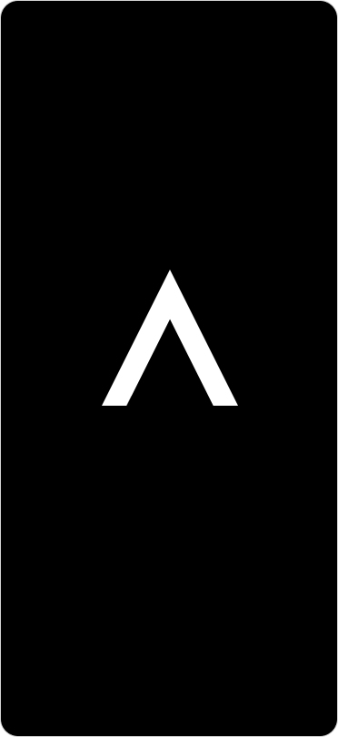
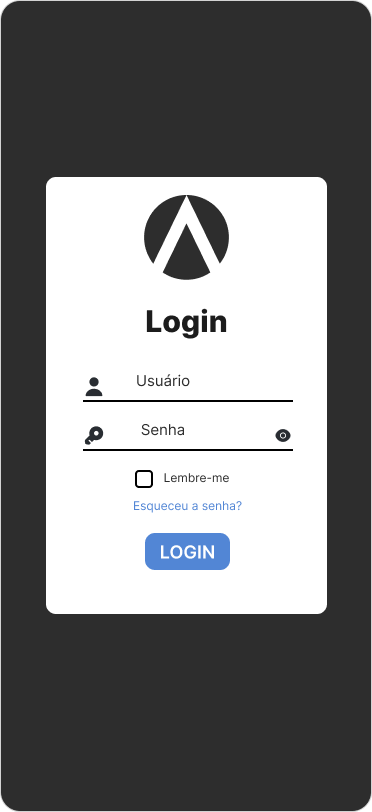
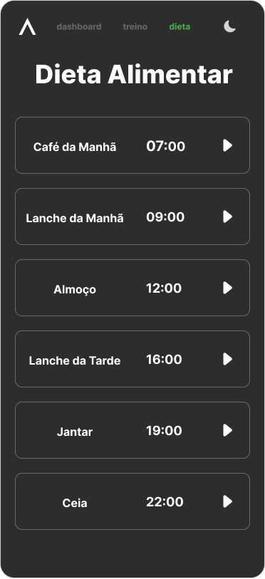
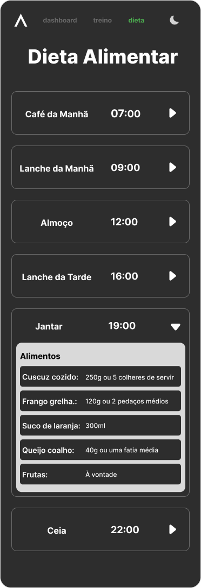
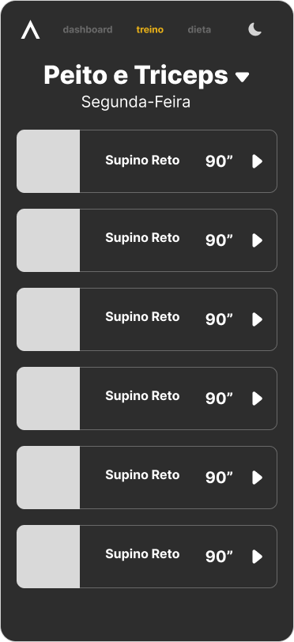
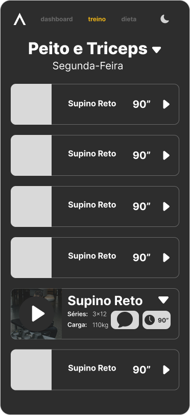

# 🎯 Achieve App - Nutrition and Training Platform

## 📱 About the Project

**Achieve App** is a cross-platform mobile application developed in **Flutter** for nutrition and physical training management. The app offers a complete experience for users seeking to track their health and wellness goals through a modern and intuitive interface.

## ✨ Key Features

- **🔐 Secure Authentication**: Complete login and registration system with secure credential storage
- **🥗 Nutrition Management**: Track diets, meals, and nutritional goals
- **💪 Training Plans**: Manage workout routines and progression
- **📊 Interactive Dashboard**: View user metrics and progress (not yet implemented)
- **🎥 Multimedia Content**: Support for exercise videos and tutorials

## 🛠️ Technologies Used

- **Flutter 3.10+**: Cross-platform development framework
- **Dart**: Programming language
- **Riverpod**: Reactive and efficient state management
- **GoRouter**: Declarative and type-safe navigation
- **Dio**: HTTP client for REST API communication
- **Flutter Secure Storage**: Secure storage for sensitive data

## 🏗️ Architecture

The project follows **Clean Architecture** principles, separating responsibilities into layers:

```
lib/
├── core/                 # Shared resources (Router, Themes, Utilities)
├── features/             # Feature modules
│   ├── auth/             # Authentication
│   │   ├── data/         # Repositories and Models
│   │   ├── domain/       # Entities and Use Cases
│   │   └── presentation/ # UI and Providers (Riverpod)
│   ├── dashboard/        # Main panel
│   ├── nutrition/        # Nutrition management
│   └── training/         # Training plans
```

This modular structure ensures:
- ✅ **Separation of concerns**
- ✅ **Testability**
- ✅ **Maintainability**
- ✅ **Scalability**

## 🚀 How to Run

### Prerequisites
- Flutter SDK 3.10+
- Dart SDK
- Android Studio / Xcode (for emulators)

### Installation

```bash
# Clone the repository
git clone [REPOSITORY_URL]

# Access the project directory
cd achieve_app_nutrition

# Install dependencies
flutter pub get

# Run the application
flutter run
```

## 📦 Production Build

```bash
# Android
flutter build apk --release

# iOS
flutter build ios --release
```

## 🎨 Technical Features

- Responsive and adaptive interface
- Custom theme (Dark Mode)
- Smooth navigation with animations
- Local data caching
- REST API integration
- Robust error handling

## 📸 Screen Prototypes

### Splash Screen


### Authentication Screen


### Diet Screen


### Diet Screen - Expanded Card


### Training Screen


### Training Screen - Expanded Card


## 👨‍💻 Developer

Project developed as part of a cross-platform mobile development portfolio.

---

**Status**: Active development 🚧

**Version**: 1.0.0

---

<br>

# 🇧🇷 Versão em Português

# 🎯 Achieve App - Plataforma de Nutrição e Treinamento

## 📱 Sobre o Projeto

**Achieve App** é uma aplicação mobile multiplataforma desenvolvida em **Flutter** para gerenciamento de nutrição e treinamento físico. O aplicativo oferece uma experiência completa para usuários que buscam acompanhar seus objetivos de saúde e bem-estar através de uma interface moderna e intuitiva.

## ✨ Principais Funcionalidades

- **🔐 Autenticação Segura**: Sistema completo de login e cadastro com armazenamento seguro de credenciais
- **🥗 Gestão Nutricional**: Acompanhamento de dietas, refeições e metas nutricionais
- **💪 Planos de Treinamento**: Gerenciamento de rotinas de exercícios e progressão
- **📊 Dashboard Interativo**: Visualização de métricas e progresso do usuário (ainda não implementado)
- **🎥 Conteúdo Multimídia**: Suporte para vídeos de exercícios e tutoriais

## 🛠️ Tecnologias Utilizadas

- **Flutter 3.10+**: Framework para desenvolvimento multiplataforma
- **Dart**: Linguagem de programação
- **Riverpod**: Gerenciamento de estado reativo e eficiente
- **GoRouter**: Navegação declarativa e type-safe
- **Dio**: Cliente HTTP para comunicação com API REST
- **Flutter Secure Storage**: Armazenamento seguro de dados sensíveis

## 🏗️ Arquitetura

O projeto segue os princípios de **Clean Architecture**, separando responsabilidades em camadas:

```
lib/
├── core/                 # Recursos compartilhados (Router, Temas, Utilitários)
├── features/             # Módulos de funcionalidades
│   ├── auth/             # Autenticação
│   │   ├── data/         # Repositórios e Models
│   │   ├── domain/       # Entidades e Casos de Uso
│   │   └── presentation/ # UI e Providers (Riverpod)
│   ├── dashboard/        # Painel principal
│   ├── nutrition/        # Gestão nutricional
│   └── training/         # Planos de treinamento
```

Essa estrutura modular garante:
- ✅ **Separação de responsabilidades**
- ✅ **Testabilidade**
- ✅ **Manutenibilidade**
- ✅ **Escalabilidade**

## 🚀 Como Executar

### Pré-requisitos
- Flutter SDK 3.10+
- Dart SDK
- Android Studio / Xcode (para emuladores)

### Instalação

```bash
# Clone o repositório
git clone [URL_DO_REPOSITORIO]

# Acesse o diretório do projeto
cd achieve_app_nutrition

# Instale as dependências
flutter pub get

# Execute o aplicativo
flutter run
```

## 📦 Build para Produção

```bash
# Android
flutter build apk --release

# iOS
flutter build ios --release
```

## 🎨 Características Técnicas

- Interface responsiva e adaptativa
- Theme customizado (Dark Mode)
- Navegação fluida com animações
- Cache de dados local
- Integração com API REST
- Tratamento robusto de erros

## 📸 Protótipos de Telas

### Splash Screen


### Authentication Screen


### Diet Screen


### Diet Screen - Card Expandido


### Training Screen


### Training Screen - Card Expandido


## 👨‍💻 Desenvolvedor

Projeto desenvolvido como parte do portfólio de desenvolvimento mobile multiplataforma.

---

**Status**: Em desenvolvimento ativo 🚧

**Versão**: 1.0.0
